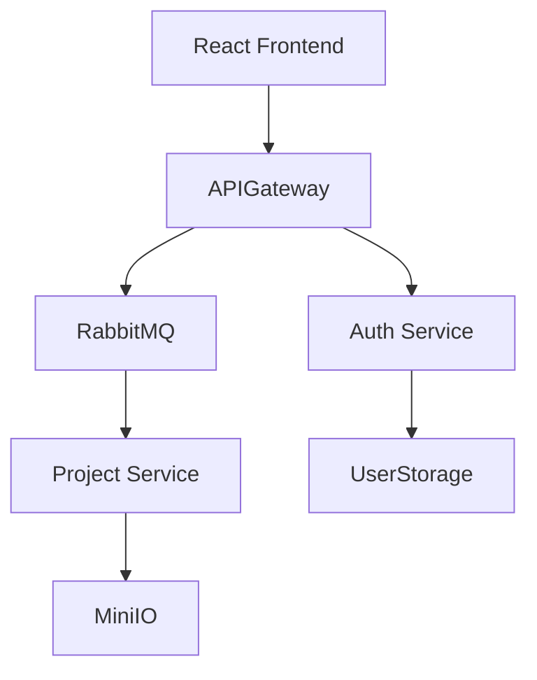

# JArch

# Brief Overview of the Domain

**Domain:** A service for generating ready-to-use Java projects based on architecture design (monolith/microservices), featuring cloud configuration storage and asynchronous generation task processing via Kafka.

**Target Audience:** Java developers, team leads, startups, and DevOps engineers — anyone who frequently creates new projects/services and wants to eliminate repetitive setup work.

---

# Purpose of the Information System

1. **Automation of routine tasks:** build initialization (Maven/Gradle), package setup, dependency management, Dockerfile creation.
2. **Accelerated development:** obtain a "ready-to-run" project skeleton within seconds or minutes.
3. **Improved reproducibility:** reusable architecture templates and cloud-based configuration storage.
4. **Scalable generation:** Kafka + queues for reliable and efficient task processing.

---

# Main Functional Requirements

1. **Authorization/Authentication** (user dashboard, roles: user, administrator).
2. **Editor:** an area for creating architecture from individual components, with sample templates.
3. **Project Generation:**

   * choose type: monolith / microservices;
   * generate pom.xml/build.gradle, package structure, layers (controller/service/repository/model);
   * create Dockerfile, docker-compose.yml, application.properties;
4. **Task Queue:** publish generation jobs to Kafka and monitor their statuses (queued, processing, success, error).
5. **Configuration Storage:** save and version user configurations in the cloud.
6. **View Logs and Artifacts:** store generation logs and build artifacts.
7. **Template Management:** admin interface for creating and editing generation templates.

---

# Non-functional Requirements

1. **Performance:** UI must respond quickly to main user actions; generation should be asynchronous.
2. **Scalability:** horizontal scalability of generation workers.
3. **Security:** HTTPS, proper secret storage (not in the repository).
4. **Portability/Deployment:** containerization using Docker.
5. **Logging and Monitoring:** task generation metrics, worker health checks (Prometheus + Grafana).

---

# Actors and Main Use Cases

**Actors:** User (developer), Administrator, Generation Workers (system actor).

1. **Create/Edit Project** — user creates or modifies a configuration.
2. **Start Generation** — user submits a generation job; the system enqueues it in Kafka.
3. **Monitor Generation Status** — user tracks progress and views logs.
4. **Download Project** — upon completion, user downloads a ZIP archive or exports to Git.
5. **Manage Templates** — admin creates or updates generator templates/libraries.
6. **Process Queue** — worker consumes messages from Kafka and executes generation.

---

# Diagrams

## Component Diagram (Mermaid)

---

# Proposed Architecture (Summary)

* **Frontend:** React
* **Backend:** Spring
* **Database:** Postgres & MinIO
* **Queue:** RabbitMQ
* **CI/Deployment:** Docker Compose

---

# Use Cases

| Aspect                | Description                                                                                                                                                                                                                                                                                |
| --------------------- | ------------------------------------------------------------------------------------------------------------------------------------------------------------------------------------------------------------------------------------------------------------------------------------------ |
| **Name**              | Authentication                                                                                                                                                                                                                                                                             |
| **Brief Description** | The user logs into the system using their credentials (email and password).                                                                                                                                                                                                                |
| **Primary Actor**     | User                                                                                                                                                                                                                                                                                       |
| **Precondition**      | The user is registered in the system.                                                                                                                                                                                                                                                      |
| **Main Flow**         | 1. The user opens the login page. 2. The system displays the authentication form. 3. The user enters email and password and confirms. 4. The system validates credentials. 5. The system generates a JWT token and updates the session. 6. The system redirects the user to the dashboard. |
| **Alternative Flow**  | 1. Invalid credentials are entered. 2. The system detects mismatch. 3. The system displays an error message.                                                                                                                                                                               |
| **Postcondition**     | The user is authenticated. A new active session is created.                                                                                                                                                                                                                                |

| **Name** | Project Configuration Creation |
| **Brief Description** | The user creates a new project architecture configuration using a visual editor. |
| **Primary Actor** | User |
| **Precondition** | The user is authenticated. |
| **Main Flow** | 1. The user selects “Create New Project”. 2. The system provides an editor interface. 3. The user selects project type. 4. The user defines the architecture. 5. The system validates the configuration. 6. The user saves it. 7. The system stores it in the cloud. |
| **Alternative Flow** | 1. Validation error occurs. 2. The system detects a configuration issue. 3. The system shows an error message. |
| **Postcondition** | The project configuration is created and stored in the user's profile. |

| **Name** | Project Generation Launch |
| **Brief Description** | The user initiates generation of project artifacts based on a saved configuration. |
| **Primary Actor** | User |
| **Precondition** | The user has a saved project configuration. |
| **Main Flow** | 1. The user selects a configuration and clicks “Generate Project”. 2. The system requests confirmation. 3. The user confirms. 4. The system creates a generation job. 5. The system publishes it to Kafka. 6. The system redirects to the monitoring page. |
| **Alternative Flow** | 1. Configuration invalid. 2. The system detects an error. 3. The system displays an error message. |
| **Postcondition** | The generation job is created and queued for processing. |

| **Name** | Generation Status Monitoring |
| **Brief Description** | The user monitors the progress and details of generation tasks. |
| **Primary Actor** | User |
| **Precondition** | The user is authenticated and has generation tasks. |
| **Main Flow** | 1. The user opens “My Tasks”. 2. The system displays a list of tasks with statuses. 3. The user selects one for details. 4. The system shows detailed information. |
| **Alternative Flow** | 1. Task is in progress. 2. The system updates status automatically. 3. The user sees real-time updates. |
| **Postcondition** | The user receives information about task execution status. |

| **Name** | Download Generated Project |
| **Brief Description** | The user downloads a ZIP archive of the generated project after successful generation. |
| **Primary Actor** | User |
| **Precondition** | The generation job has status SUCCESS. |
| **Main Flow** | 1. The user clicks “Download” on the task detail page. 2. The system generates a storage link. 3. The system starts the download. 4. The user receives the archive. |
| **Alternative Flow** | 1. Archive not found. 2. The system detects access error. 3. The system displays an error message. |
| **Postcondition** | The user receives the ZIP archive of the project. |

| **Name** | Project Template Management |
| **Brief Description** | The administrator manages available project templates for generation. |
| **Primary Actor** | Administrator |
| **Precondition** | The user is authenticated and has the “Administrator” role. |
| **Main Flow** | 1. The admin opens the template management panel. 2. The system lists existing templates. 3. The admin adds/edits/deletes a template. 4. The system performs the requested action. 5. The system updates the list. |
| **Alternative Flow** | 1. Template validation error. 2. The system detects an issue. 3. The system displays an error message. |
| **Postcondition** | Project templates are updated in the system. |

| **Name** | View Configuration History |
| **Brief Description** | The user views the history of their saved project configurations. |
| **Primary Actor** | User |
| **Precondition** | The user is authenticated. |
| **Main Flow** | 1. The user navigates to “My Configurations”. 2. The system displays a list of saved configurations. 3. The user selects one to view. 4. The system displays details. |
| **Alternative Flow** | 1. No configurations found. 2. The system displays a message. 3. The user can create a new one. |
| **Postcondition** | The user has viewed their configuration history. |

| **Name** | Edit Existing Configuration |
| **Brief Description** | The user modifies an existing saved project configuration. |
| **Primary Actor** | User |
| **Precondition** | The user is authenticated and has saved configurations. |
| **Main Flow** | 1. The user selects a configuration. 2. Clicks “Edit”. 3. The system opens the editor with preloaded data. 4. The user makes changes. 5. The user saves. 6. The system stores a new version. |
| **Alternative Flow** | 1. Validation error. 2. The system detects it. 3. The system displays an error message. |
| **Postcondition** | The project configuration is updated and saved. |

| **Name** | Delete Project Configuration |
| **Brief Description** | The user deletes a saved project configuration from their profile. |
| **Primary Actor** | User |
| **Precondition** | The user is authenticated and has saved configurations. |
| **Main Flow** | 1. The user selects a configuration. 2. Clicks “Delete”. 3. The system requests confirmation. 4. The user confirms. 5. The system deletes the configuration. 6. The system updates the list. |
| **Alternative Flow** | 1. The user cancels deletion. 2. The system aborts the operation. 3. The configuration remains unchanged. |
| **Postcondition** | The configuration is deleted from the user's profile. |

| **Name** | Logout |
| **Brief Description** | The user ends their active session. |
| **Primary Actor** | User |
| **Precondition** | The user is authenticated. |
| **Main Flow** | 1. The user clicks “Logout”. 2. The system ends the session. 3. The system deletes the JWT token. 4. The system redirects to the login page. |
| **Alternative Flow** | 1. Logout error. 2. The system displays an error message. 3. The user remains logged in. |
| **Postcondition** | The user session is terminated, and the authentication token is deleted. |

---

Хочешь, чтобы я оформил это в виде структурированного **технического документа (в Markdown или DOCX)** для отчёта или проекта?
