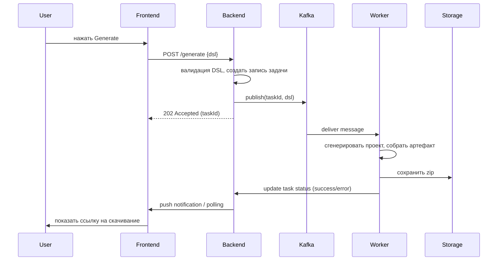

# JArch
# Краткое резюме предметной области

**Предметная область:** Сервис генерации готовых Java-проектов по описанию архитектуры на DSL (монолит/микросервисы) с облачным хранением конфигураций и асинхронной обработкой задач генерации через Kafka.

**Кому полезно:** Java-разработчики, тимлиды, стартапы, DevOps-инженеры — те, кто часто и быстро создаёт новые проекты/сервисы и хочет избавиться от рутинной настройки.

---

# Зачем нужна информационная система

1. **Автоматизация рутинных задач**: инициализация сборки (Maven/Gradle), настройка пакетов, подключение зависимостей, Dockerfile.
2. **Снижение ошибок конфигурации**: единый DSL и шаблоны уменьшают несогласованности и человеческие ошибки.
3. **Ускорение разработки**: за счёт получения «готового к запуску» каркаса проекта за секунды/минуты.
4. **Повышение воспроизводимости**: повторяемые шаблоны архитектур и облачное хранилище конфигураций.
5. **Масштабируемость генерации**: Kafka + очереди для надёжной и эффективной обработки тяжёлых задач.

---

# Основные функциональные требования

1. **Авторизация/аутентификация** (личный кабинет, роли: пользователь, администратор).
2. **Редактор DSL**: синтаксическая подсветка, валидация, примеры шаблонов.
3. **Генерация проекта**:

   * выбор типа: монолит / микросервисы;
   * формирование pom.xml/build.gradle, структуры пакетов, слоёв (controller/service/repository/model);
   * создание Dockerfile, docker-compose.yml, application.properties;
   * опционально: генерация Maven BOM для микросервисов.
4. **Очередь задач**: публикация задания на генерацию в Kafka, мониторинг статуса задач (queued, processing, success, error).
5. **Хранилище конфигураций**: сохранение/версионирование DSL-конфигураций в облачном профиле пользователя.
6. **Скачивание/клонирование**: скачивание архива с проектом; автозалив в Git-репозиторий (опционально).
7. **Просмотр логов и артефактов**: хранение логов генерации и артефактов сборки.
8. **Конфигурация шаблонов**: интерфейс для администратора по созданию/редактированию шаблонов генерации.

---

# Нефункциональные требования

1. **Производительность**: UI должен откликаться < 200 мс на основные действия; процесс генерации — асинхронный.
2. **Масштабируемость**: горизонтальная масштабируемость воркеров генерации.
3. **Надёжность**: сообщения Kafka не теряются (использовать подтверждения), повторная попытка при ошибках.
4. **Безопасность**: HTTPS, хранение секретов (не в репозитории), RBAC, защита от CSRF/XSS.
5. **Портируемость/Развёртывание**: контейнеризация (Docker), конфигурации для деплоя на сервере helios.
6. **Поддерживаемость**: чистая модульная архитектура, тесты для шаблонов генерации.
7. **Логирование и мониторинг**: метрики генерации задач, health-check воркеров.

---

# Акторы и основные прецеденты (use cases)

**Акторы:** Пользователь (разработчик), Администратор, Воркеры генерации (system actor).

1. **Создать/редактировать DSL-проект** — пользователь создаёт или правит конфигурацию на DSL.
2. **Запустить генерацию** — пользователь отправляет задачу генерации; система ставит запись в очередь Kafka.
3. **Мониторить статус генерации** — пользователь наблюдает прогресс и просматривает логи.
4. **Скачать проект** — по завершении пользователь скачивает zip-архив или экспортирует в Git.
5. **Управлять шаблонами** — администратор создаёт шаблоны/библиотеки для генератора.
6. **Обслуживание очереди** — воркер обрабатывает сообщение из Kafka и выполняет генерацию.

## Краткие описания прецедентов (пример)

**Прецедент:** "Запустить генерацию"

* Актор: Пользователь
* Предусловия: Пользователь авторизован; DSL валиден и сохранён.
* Сценарий: Пользователь нажимает Generate → UI отправляет запрос на backend → backend валидирует DSL → создаёт запись задачи и публикует сообщение в Kafka → воркер подхватывает сообщение → генерирует проект, собирает артефакт → сохраняет артефакт в хранилище и меняет статус задачи → пользователь получает уведомление и может скачать.
* Постусловия: Архив с проектом доступен, лог генерации сохранён.

---

# Диаграммы (схемы)

## Компонентная диаграмма (Mermaid)

```mermaid
graph TD
  UI[React Frontend]
  API[Backend — Spring MVC]
  Auth[Auth Service]
  DB[PostgreSQL]
  Kafka[Apache Kafka]
  Worker[Generator Workers]
  Storage[Artifact Storage]
  Docker[Docker / Helios deploy]

  UI --> REST API
  API --> Auth
  API --> DB
  API -->|produce| Kafka
  Worker -->|consume| Kafka
  Worker --> Storage
  Worker --> DB
  API -.-> Storage
  API -->|admin| TemplateRepo[Template Store]
  subgraph Helios
    Docker
    Worker
  end
```

## Последовательность (flow) — генерация проекта



---

# Предложенная архитектура (кратко)

* **Frontend**: React.
* **Backend**: Spring.
* **DB**: Postgres.
* **Очередь**: Kafka.
* **CI/Deployment**: Docker Compose.

---
