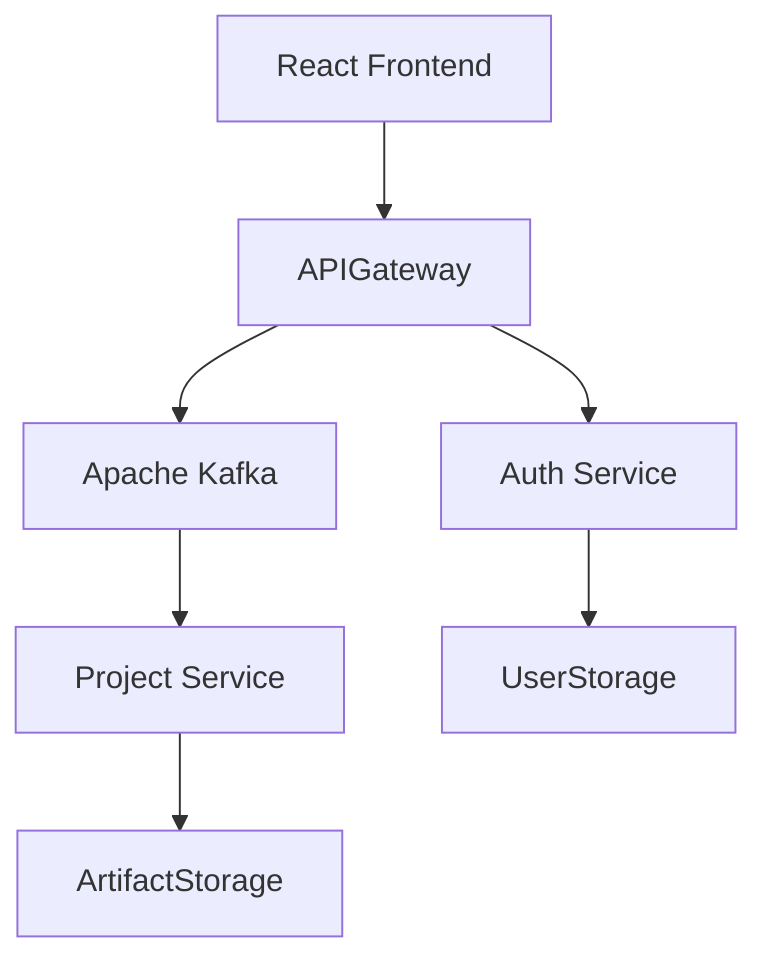

# JArch
# Краткое резюме предметной области

**Предметная область:** Сервис генерации готовых Java-проектов по конструированию архитектуры (монолит/микросервисы) с облачным хранением конфигураций и асинхронной обработкой задач генерации через Kafka.

**Кому полезно:** Java-разработчики, тимлиды, стартапы, DevOps-инженеры — те, кто часто и быстро создаёт новые проекты/сервисы и хочет избавиться от рутинной настройки.

---

# Зачем нужна информационная система

1. **Автоматизация рутинных задач**: инициализация сборки (Maven/Gradle), настройка пакетов, подключение зависимостей, Dockerfile.
2. **Ускорение разработки**: за счёт получения «готового к запуску» каркаса проекта за секунды/минуты.
3. **Повышение воспроизводимости**: повторяемые шаблоны архитектур и облачное хранилище конфигураций.
4. **Масштабируемость генерации**: Kafka + очереди для надёжной и эффективной обработки задач.

---

# Основные функциональные требования

1. **Авторизация/аутентификация** (личный кабинет, роли: пользователь, администратор).
2. **Редактор**: область для создания архитектуры из отдельных элементов, примеры шаблонов.
3. **Генерация проекта**:
   * выбор типа: монолит / микросервисы;
   * формирование pom.xml/build.gradle, структуры пакетов, слоёв (controller/service/repository/model);
   * создание Dockerfile, docker-compose.yml, application.properties;
4. **Очередь задач**: публикация задания на генерацию в Kafka, мониторинг статуса задач (queued, processing, success, error).
5. **Хранилище конфигураций**: сохранение/версионирование конфигураций в облачном профиле пользователя.
6. **Просмотр логов и артефактов**: хранение логов генерации и артефактов сборки.
7. **Конфигурация шаблонов**: интерфейс для администратора по созданию/редактированию шаблонов генерации.

---

# Нефункциональные требования

1. **Производительность**: UI должен откликаться на основные действия; процесс генерации — асинхронный.
2. **Масштабируемость**: горизонтальная масштабируемость воркеров генерации.
3. **Безопасность**: HTTPS, хранение секретов (не в репозитории).
4. **Портируемость/Развёртывание**: контейнеризация (Docker).
5. **Логирование и мониторинг**: метрики генерации задач, health-check воркеров (Prometheus + Grafana).

---

# Акторы и основные прецеденты (use cases)

**Акторы:** Пользователь (разработчик), Администратор, Воркеры генерации (system actor).

1. **Создать/редактировать проект** — пользователь создаёт или правит конфигурацию.
2. **Запустить генерацию** — пользователь отправляет задачу генерации; система ставит запись в очередь Kafka.
3. **Мониторить статус генерации** — пользователь наблюдает прогресс и просматривает логи.
4. **Скачать проект** — по завершении пользователь скачивает zip-архив или экспортирует в Git.
5. **Управлять шаблонами** — администратор создаёт шаблоны/библиотеки для генератора.
6. **Обслуживание очереди** — воркер обрабатывает сообщение из Kafka и выполняет генерацию.

# Диаграммы (схемы)

## Компонентная диаграмма (Mermaid)

---

# Предложенная архитектура (кратко)

* **Frontend**: React.
* **Backend**: Spring.
* **DB**: Postgres.
* **Очередь**: Kafka.
* **CI/Deployment**: Docker Compose.

---
