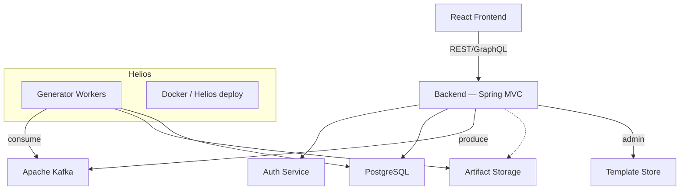
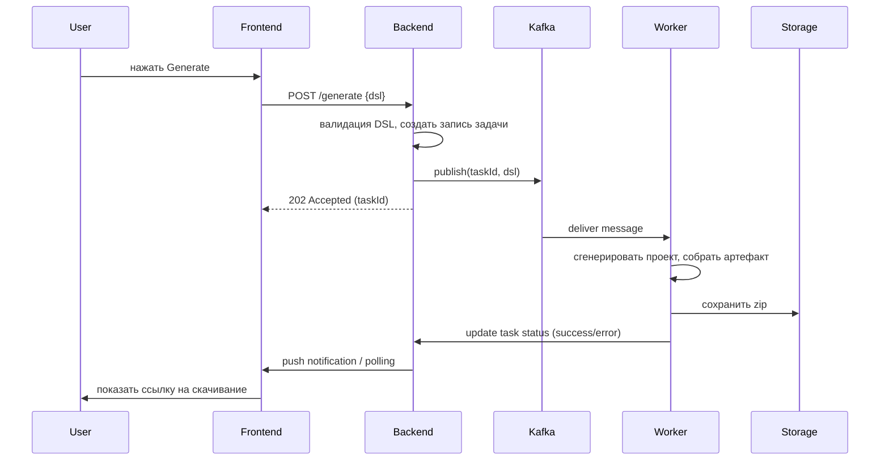

# JArch
# Краткое резюме предметной области

**Предметная область:** Сервис генерации готовых Java-проектов по описанию архитектуры на DSL (монолит/микросервисы) с облачным хранением конфигураций и асинхронной обработкой задач генерации через Kafka.

**Кому полезно:** Java-разработчики, тимлиды, стартапы, DevOps-инженеры — те, кто часто и быстро создаёт новые проекты/сервисы и хочет избавиться от рутинной настройки.

---

# Зачем нужна информационная система

1. **Автоматизация рутинных задач**: инициализация сборки (Maven/Gradle), настройка пакетов, подключение зависимостей, Dockerfile, inter-service конфигурация.
2. **Снижение ошибок конфигурации**: единый DSL и шаблоны уменьшают несогласованности и человеческие ошибки.
3. **Ускорение разработки**: за счёт получения «готового к запуску» каркаса проекта за секунды/минуты.
4. **Повышение воспроизводимости**: повторяемые шаблоны архитектур и облачное хранилище конфигураций.
5. **Масштабируемость генерации**: Kafka + очереди для надёжной и эффективной обработки тяжёлых задач.

---

# Основные функциональные требования

1. **Авторизация/аутентификация** (личный кабинет, роли: пользователь, администратор).
2. **Редактор DSL**: синтаксическая подсветка, валидация, примеры шаблонов.
3. **Генерация проекта**:

   * выбор типа: монолит / микросервисы;
   * формирование pom.xml/build.gradle, структуры пакетов, слоёв (controller/service/repository/model);
   * создание Dockerfile, docker-compose.yml, application.properties;
   * опционально: генерация Maven BOM для микросервисов.
4. **Очередь задач**: публикация задания на генерацию в Kafka, мониторинг статуса задач (queued, processing, success, error).
5. **Хранилище конфигураций**: сохранение/версионирование DSL-конфигураций в облачном профиле пользователя.
6. **Скачивание/клонирование**: скачивание архива с проектом; автозалив в Git-репозиторий (опционально).
7. **Просмотр логов и артефактов**: хранение логов генерации и артефактов сборки.
8. **Конфигурация шаблонов**: интерфейс для администратора по созданию/редактированию шаблонов генерации.

---

# Нефункциональные требования

1. **Производительность**: UI должен откликаться < 200 мс на основные действия; процесс генерации — асинхронный.
2. **Масштабируемость**: горизонтальная масштабируемость воркеров генерации.
3. **Надёжность**: сообщения Kafka не теряются (использовать подтверждения), повторная попытка при ошибках.
4. **Безопасность**: HTTPS, хранение секретов (не в репозитории), RBAC, защита от CSRF/XSS.
5. **Портируемость/Развёртывание**: контейнеризация (Docker), конфигурации для деплоя на сервере helios.
6. **Поддерживаемость**: чистая модульная архитектура, тесты для шаблонов генерации.
7. **Логирование и мониторинг**: метрики генерации задач, health-check воркеров.

---

# Акторы и основные прецеденты (use cases)

**Акторы:** Пользователь (разработчик), Администратор, Воркеры генерации (system actor).

1. **Создать/редактировать DSL-проект** — пользователь создаёт или правит конфигурацию на DSL.
2. **Запустить генерацию** — пользователь отправляет задачу генерации; система ставит запись в очередь Kafka.
3. **Мониторить статус генерации** — пользователь наблюдает прогресс и просматривает логи.
4. **Скачать проект** — по завершении пользователь скачивает zip-архив или экспортирует в Git.
5. **Управлять шаблонами** — администратор создаёт шаблоны/библиотеки для генератора.
6. **Обслуживание очереди** — воркер обрабатывает сообщение из Kafka и выполняет генерацию.

## Краткие описания прецедентов (пример)

**Прецедент:** "Запустить генерацию"

* Актор: Пользователь
* Предусловия: Пользователь авторизован; DSL валиден и сохранён.
* Сценарий: Пользователь нажимает Generate → UI отправляет запрос на backend → backend валидирует DSL → создаёт запись задачи и публикует сообщение в Kafka → воркер подхватывает сообщение → генерирует проект, собирает артефакт → сохраняет артефакт в хранилище и меняет статус задачи → пользователь получает уведомление и может скачать.
* Постусловия: Архив с проектом доступен, лог генерации сохранён.

---

# Диаграммы (схемы)

## Компонентная диаграмма (Mermaid)



## Последовательность (flow) — генерация проекта



---

# Предложенная архитектура (кратко)

* **Frontend (React)**: SPA, редактор DSL ( Ace/Monaco ), страница задач, личный кабинет.
* **Backend (Spring MVC)**: REST API, сервисы: Auth, ProjectService, TaskService, TemplateService, Admin.
* **DB (Postgres)**: хранение пользователей, задач, метаданных артефактов, шаблонов.
* **Очередь (Kafka)**: топики tasks.generate, tasks.status.
* **Worker pool**: горизонтально масштабируемые контейнеры (Docker) на helios, выполняют генерацию и сборку.
* **Artifact Storage**: S3-совместимое хранилище или локальный диск на сервере; хранит zip-архивы и логи.
* **CI/Deployment**: образы Docker для backend/worker/frontend; Compose/Helm chart для развёртывания на helios.

**Замечание по helios:** все порции демонстрации и развёртывания должны быть подготовлены как Docker-образы и/или docker-compose / Helm-манифесты, чтобы преподаватель мог запустить на сервере helios.

---

# Технологии и фреймворки (предлагается согласовать с преподавателем)

* Frontend: **React**, редактор кода — **Monaco Editor** или **Ace Editor**.
* Backend: **Spring MVC** (Spring Boot) + Spring Security.
* Генератор: кастомная библиотека на Java (шаблоны Freemarker/Velocity/Thymeleaf или шаблоны файлов) — можно применять шаблонизатор + codegen модуль.
* БД: **PostgreSQL**.
* Очередь: **Apache Kafka**.
* Контейнеризация: **Docker**, orchestration — Helios (или Docker Compose / Kubernetes в зависимости от договорённости).
* Дополнительно: Maven/Gradle wrapper, Git-интеграция, S3-совместимое хранилище (minio) для артефактов.

---

# План отчёта (структура)

1. Титульный лист
2. Краткое описание предметной области
3. Цели и задачи системы
4. Функциональные / нефункциональные требования
5. Модели прецедентов (диаграммы + описания)
6. Архитектура системы (компонентная диаграмма, sequence)
7. Выбранные технологии и обоснование
8. Проект развёртывания на helios (инструкции + docker-compose / helm)
9. Примеры DSL и сгенерированного кода (скриншоты/файлы)
10. Тестирование и сценарии демонстрации
11. Заключение

---

# Пример минимального DSL (образец)

```
project MyApp {
  type: microservices
  services: [auth, users, orders]

  auth {
    port: 8081
    db: postgres
    security: jwt
  }

  users {
    port: 8082
    db: postgres
  }

  orders {
    port: 8083
    db: postgres
    dependsOn: [users]
  }

  infrastructure {
    docker: true
    kafka: true
    artifactRepo: s3
  }
}
```

---

# Рекомендации по демонстрации на helios

1. Подготовить Docker-образы backend и worker; хранить в registry (или в локальном реестре сервера).
2. Подготовить docker-compose.yml с зависимостями: postgres, kafka, zookeeper (или внешние), minio.
3. Описать шаги запуска демонстрации: загрузить образ, прокинуть переменные окружения, запустить compose.
4. При демонстрации показать: создание DSL → запуск генерации → состояние задачи → скачивание архива.

---

# Что можно представить преподавателю для согласования

* Выбор редактора (Monaco vs Ace)
* Способ хранения артефактов (S3 vs локальный диск)
* Параметры Kafka (количество партий/реплик) и требования к доступности на helios
* Использование Maven vs Gradle в целевых проектах

---

Если нужно, могу сгенерировать компактные SVG-диаграммы (Mermaid->SVG) или подготовить docker-compose и пример проекта — укажите, какие артефакты хотите видеть первыми.
