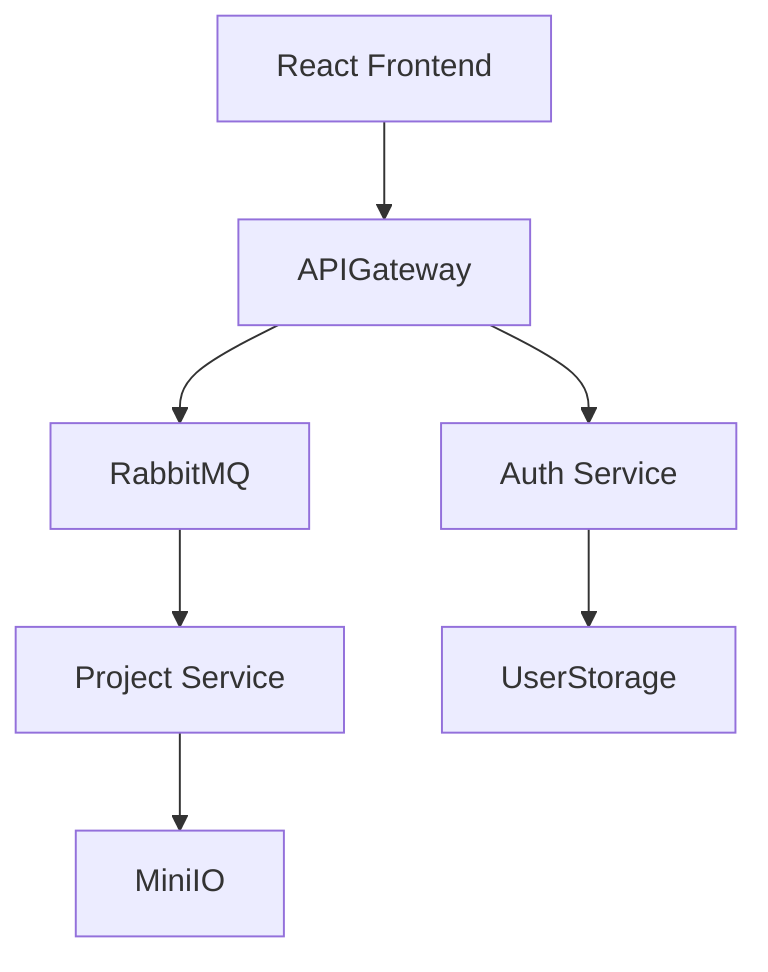

# JArch
# Краткое резюме предметной области

**Предметная область:** Сервис генерации готовых Java-проектов по конструированию архитектуры (монолит/микросервисы) с облачным хранением конфигураций и асинхронной обработкой задач генерации через Kafka.

**Кому полезно:** Java-разработчики, тимлиды, стартапы, DevOps-инженеры — те, кто часто и быстро создаёт новые проекты/сервисы и хочет избавиться от рутинной настройки.

---

# Зачем нужна информационная система

1. **Автоматизация рутинных задач**: инициализация сборки (Maven/Gradle), настройка пакетов, подключение зависимостей, Dockerfile.
2. **Ускорение разработки**: за счёт получения «готового к запуску» каркаса проекта за секунды/минуты.
3. **Повышение воспроизводимости**: повторяемые шаблоны архитектур и облачное хранилище конфигураций.
4. **Масштабируемость генерации**: Kafka + очереди для надёжной и эффективной обработки задач.

---

# Основные функциональные требования

1. **Авторизация/аутентификация** (личный кабинет, роли: пользователь, администратор).
2. **Редактор**: область для создания архитектуры из отдельных элементов, примеры шаблонов.
3. **Генерация проекта**:
   * выбор типа: монолит / микросервисы;
   * формирование pom.xml/build.gradle, структуры пакетов, слоёв (controller/service/repository/model);
   * создание Dockerfile, docker-compose.yml, application.properties;
4. **Очередь задач**: публикация задания на генерацию в Kafka, мониторинг статуса задач (queued, processing, success, error).
5. **Хранилище конфигураций**: сохранение/версионирование конфигураций в облачном профиле пользователя.
6. **Просмотр логов и артефактов**: хранение логов генерации и артефактов сборки.
7. **Конфигурация шаблонов**: интерфейс для администратора по созданию/редактированию шаблонов генерации.

---

# Нефункциональные требования

1. **Производительность**: UI должен откликаться на основные действия; процесс генерации — асинхронный.
2. **Масштабируемость**: горизонтальная масштабируемость воркеров генерации.
3. **Безопасность**: HTTPS, хранение секретов (не в репозитории).
4. **Портируемость/Развёртывание**: контейнеризация (Docker).
5. **Логирование и мониторинг**: метрики генерации задач, health-check воркеров (Prometheus + Grafana).

---

# Акторы и основные прецеденты (use cases)

**Акторы:** Пользователь (разработчик), Администратор, Воркеры генерации (system actor).

1. **Создать/редактировать проект** — пользователь создаёт или правит конфигурацию.
2. **Запустить генерацию** — пользователь отправляет задачу генерации; система ставит запись в очередь Kafka.
3. **Мониторить статус генерации** — пользователь наблюдает прогресс и просматривает логи.
4. **Скачать проект** — по завершении пользователь скачивает zip-архив или экспортирует в Git.
5. **Управлять шаблонами** — администратор создаёт шаблоны/библиотеки для генератора.
6. **Обслуживание очереди** — воркер обрабатывает сообщение из Kafka и выполняет генерацию.

# Диаграммы (схемы)

## Компонентная диаграмма (Mermaid)

---

# Предложенная архитектура (кратко)

* **Frontend**: React.
* **Backend**: Spring.
* **DB**: Postgres & MinIO.
* **Очередь**: RabbitMQ.
* **CI/Deployment**: Docker Compose.

---

# Прецеденты
| Аспект | Описание |
| --- | --- |
| Название | Аутентификация |  
| Краткое описание | Пользователь входит в систему, используя свои учетные данные (email и пароль). |
| Главный актор | Пользователь |
| Предусловие | Пользователь зарегистрирован в системе. |
| Основной поток | 1. Пользователь открывает страницу входа. 2. Система отображает форму аутентификации. 3. Пользователь вводит email и пароль и подтверждает ввод. 4. Система проверяет учетные данные. 5. Система создает JWT-токен и обновляет сессию. 6. Система перенаправляет пользователя в личный кабинет. |
| Альтернативный поток | 1. Введены неверные учетные данные 2. Система обнаруживает несоответсвие логина или пароля 3. Система показывает сообщение об ошибке |
| Постуловие | Пользователь аутентифицирован. Создана и активна новая сессия. |

| Аспект | Описание |
| --- | --- |
| Название | Создание конфигурации проекта |
| Краткое описание | Пользователь создает новую конфигурацию архитектуры проекта с помощью визуального редактора |
| Главный актор | Пользователь |
| Предусловие | Пользователь аутентифицирован в системе. |
| Основной поток | 1. Пользователь в личном кабинете выбирает опцию "Создать новый проект". 2. Система предоставляет интерфейс редактора. 3. Пользователь выбирает тип проекта. 4. Пользователь описывает архитектуру. 5. Система валидирует конфигурацию. 6. Пользователь сохраняет конфигурацию. 7. Система сохраняет конфигурацию в облачном хранилище. |
| Альтернативный поток | 1. Ошибка валидации конфигурации 2. Система обнаруживает ошибку в конфигурации 3. Система показывает сообщение об ошибке |
| Постуловие | Новая конфигурация проекта создана и сохранена в профиле пользователя. |

| Аспект | Описание |
| --- | --- |
| Название | Запуск генерации проекта |
| Краткое описание | Пользователь инициирует процесс генерации артефактов проекта на основе сохраненной конфигурации. |
| Главный актор | Пользователь |
| Предусловие | В профиле пользователя есть сохраненная конфигурация проекта. |
| Основной поток | 1. Пользователь выбирает конфигурацию и нажимает "Сгенерировать проект". 2. Система запрашивает подтверждение. 3. Пользователь подтверждает запуск генерации. 4. Система создает задачу генерации. 5. Система публикует сообщение в Kafka. 6. Система перенаправляет на страницу мониторинга. |
| Альтернативный поток | 1. Конфигурация невалидна 2. Система обнаруживает ошибку 3. Система показывает сообщение об ошибке |
| Постуловие | Задача на генерацию создана и поставлена в очередь на обработку. |

| Аспект | Описание |
| --- | --- |
| Название | Мониторинг статуса генерации |
| Краткое описание | Пользователь отслеживает статус выполнения своих задач генерации и просматривает детали. |
| Главный актор | Пользователь |
| Предусловие | Пользователь аутентифицирован и имеет задачи генерации. |
| Основной поток | 1. Пользователь переходит на вкладку "Мои задачи". 2. Система отображает список задач с статусами. 3. Пользователь выбирает задачу для просмотра деталей. 4. Система отображает подробную информацию о задаче. |
| Альтернативный поток | 1. Задача в процессе выполнения 2. Система автоматически обновляет статус 3. Пользователь видит актуальный статус в реальном времени |
| Постуловие | Пользователь получил информацию о статусе выполнения задачи. |

| Аспект | Описание |
| --- | --- |
| Название | Скачивание сгенерированного проекта |
| Краткое описание | Пользователь скачивает ZIP-архив со сгенерированным проектом после успешной генерации. |
| Главный актор | Пользователь |
| Предусловие | Задача генерации имеет статус SUCCESS. |
| Основной поток | 1. Пользователь на странице деталей задачи нажимает "Скачать". 2. Система формирует ссылку на архив в хранилище. 3. Система инициирует скачивание архива на устройство пользователя. 4. Пользователь получает архив с проектом. |
| Альтернативный поток | 1. Архив не найден 2. Система обнаруживает ошибку доступа 3. Система показывает сообщение об ошибке |
| Постуловие | Пользователь получил архив со сгенерированным проектом. |

| Аспект | Описание |
| --- | --- |
| Название | Управление шаблонами проектов |
| Краткое описание | Администратор управляет шаблонами проектов, доступными для генерации. |
| Главный актор | Администратор |
| Предусловие | Пользователь аутентифицирован и имеет роль "Администратор". |
| Основной поток | 1. Администратор переходит в панель управления шаблонами. 2. Система отображает список существующих шаблонов. 3. Администратор выбирает действие (добавить/редактировать/удалить). 4. Система выполняет запрошенное действие. 5. Система обновляет список шаблонов. |
| Альтернативный поток | 1. Ошибка валидации шаблона 2. Система обнаруживает ошибку 3. Система показывает сообщение об ошибке |
| Постуловие | Шаблоны проектов обновлены в системе. |

| Аспект | Описание |
| --- | --- |
| Название | Просмотр истории конфигураций |
| Краткое описание | Пользователь просматривает историю своих сохраненных конфигураций проектов. |
| Главный актор | Пользователь |
| Предусловие | Пользователь аутентифицирован в системе. |
| Основной поток | 1. Пользователь переходит в раздел "Мои конфигурации". 2. Система отображает список всех конфигураций пользователя. 3. Пользователь выбирает конфигурацию для просмотра. 4. Система показывает детали выбранной конфигурации. |
| Альтернативный поток | 1. Конфигураций не найдено 2. Система показывает сообщение об отсутствии конфигураций 3. Пользователь может создать новую конфигурацию |
| Постуловие | Пользователь просмотрел историю своих конфигураций. |

| Аспект | Описание |
| --- | --- |
| Название | Редактирование существующей конфигурации |
| Краткое описание | Пользователь вносит изменения в ранее сохраненную конфигурацию проекта. |
| Главный актор | Пользователь |
| Предусловие | Пользователь аутентифицирован и имеет сохраненные конфигурации. |
| Основной поток | 1. Пользователь выбирает конфигурацию из списка. 2. Пользователь нажимает "Редактировать". 3. Система открывает редактор с загруженной конфигурацией. 4. Пользователь вносит изменения. 5. Пользователь сохраняет изменения. 6. Система сохраняет новую версию конфигурации. |
| Альтернативный поток | 1. Ошибка валидации изменений 2. Система обнаруживает ошибку 3. Система показывает сообщение об ошибке |
| Постуловие | Конфигурация проекта обновлена и сохранена в профиле пользователя. |

| Аспект | Описание |
| --- | --- |
| Название | Удаление конфигурации проекта |
| Краткое описание | Пользователь удаляет сохраненную конфигурацию проекта из своего профиля. |
| Главный актор | Пользователь |
| Предусловие | Пользователь аутентифицирован и имеет сохраненные конфигурации. |
| Основной поток | 1. Пользователь выбирает конфигурацию из списка. 2. Пользователь нажимает "Удалить". 3. Система запрашивает подтверждение удаления. 4. Пользователь подтверждает удаление. 5. Система удаляет конфигурацию из хранилища. 6. Система обновляет список конфигураций. |
| Альтернативный поток | 1. Пользователь отменяет удаление 2. Система прерывает операцию удаления 3. Конфигурация остается неизменной |
| Постуловие | Конфигурация проекта удалена из профиля пользователя. |

| Аспект | Описание |
| --- | --- |
| Название | Выход из системы |
| Краткое описание | Пользователь завершает текущую сессию работы с системой. |
| Главный актор | Пользователь |
| Предусловие | Пользователь аутентифицирован в системе. |
| Основной поток | 1. Пользователь нажимает кнопку "Выйти". 2. Система заканчивает текущую сессию. 3. Система удаляет JWT-токен. 4. Система перенаправляет пользователя на страницу входа. |
| Альтернативный поток | 1. Ошибка при выходе 2. Система показывает сообщение об ошибке 3. Пользователь остается в системе |
| Постуловие | Сессия пользователя завершена, токен аутентификации удален. |

