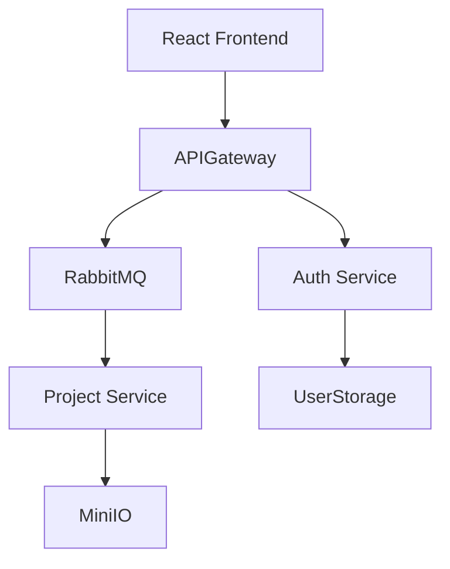

# JArch

# Brief Overview of the Domain

**Domain:** A service for generating ready-to-use Java projects based on architecture design (monolith/microservices), featuring cloud configuration storage and asynchronous generation task processing via Kafka.

**Target Audience:** Java developers, team leads, startups, and DevOps engineers — anyone who frequently creates new projects/services and wants to eliminate repetitive setup work.

---

# Purpose of the Information System

1. **Automation of routine tasks:** build initialization (Maven/Gradle), package setup, dependency management, Dockerfile creation.
2. **Accelerated development:** obtain a "ready-to-run" project skeleton within seconds or minutes.
3. **Improved reproducibility:** reusable architecture templates and cloud-based configuration storage.
4. **Scalable generation:** Kafka + queues for reliable and efficient task processing.

---

# Main Functional Requirements

1. **Authorization/Authentication** (user dashboard, roles: user, administrator).
2. **Editor:** an area for creating architecture from individual components, with sample templates.
3. **Project Generation:**

   * choose type: monolith / microservices;
   * generate pom.xml/build.gradle, package structure, layers (controller/service/repository/model);
   * create Dockerfile, docker-compose.yml, application.properties;
4. **Task Queue:** publish generation jobs to Kafka and monitor their statuses (queued, processing, success, error).
5. **Configuration Storage:** save and version user configurations in the cloud.
6. **View Logs and Artifacts:** store generation logs and build artifacts.
7. **Template Management:** admin interface for creating and editing generation templates.

---

# Non-functional Requirements

1. **Performance:** UI must respond quickly to main user actions; generation should be asynchronous.
2. **Scalability:** horizontal scalability of generation workers.
3. **Security:** HTTPS, proper secret storage (not in the repository).
4. **Portability/Deployment:** containerization using Docker.
5. **Logging and Monitoring:** task generation metrics, worker health checks (Prometheus + Grafana).

---

# Actors and Main Use Cases

**Actors:** User (developer), Administrator, Generation Workers (system actor).

1. **Create/Edit Project** — user creates or modifies a configuration.
2. **Start Generation** — user submits a generation job; the system enqueues it in Kafka.
3. **Monitor Generation Status** — user tracks progress and views logs.
4. **Download Project** — upon completion, user downloads a ZIP archive or exports to Git.
5. **Manage Templates** — admin creates or updates generator templates/libraries.
6. **Process Queue** — worker consumes messages from Kafka and executes generation.

---

# Diagrams

## Component Diagram (Mermaid)

---

# Proposed Architecture (Summary)

* **Frontend:** React
* **Backend:** Spring
* **Database:** Postgres & MinIO
* **Queue:** RabbitMQ
* **CI/Deployment:** Docker Compose

---
